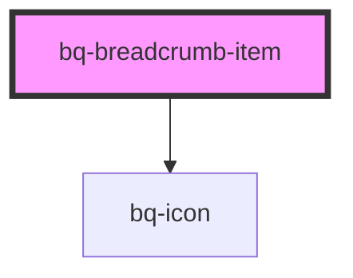

# bq-breadcrumb-item

<!-- Auto Generated Below -->

## Properties

| Property   | Attribute  | Description                                                       | Type      | Default     |
| ---------- | ---------- | ----------------------------------------------------------------- | --------- | ----------- |
| `dropdown` | `dropdown` | Contains an arrow If prop is set to true, it displays the options | `boolean` | `undefined` |
| `link`     | `link`     | Contains a URL If prop is set, an anchor tag will be rendered     | `string`  | `undefined` |

## Shadow Parts

| Part         | Description                                                   |
| ------------ | ------------------------------------------------------------- |
| `"base"`     | The component's internal wrapper of the breadcrumb component. |
| `"dropdown"` | The `` element that holds the dropdown.                 |
| `"link"`     | The native HTML `<input type="radio">` used under the hood.   |
| `"prefix"`   | The `` element that holds the prefix.                   |

## Dependencies

### Depends on

- [bq-icon](../icon)

### Graph

----------------------------------------------

*Built with [StencilJS](https://stenciljs.com/)*
