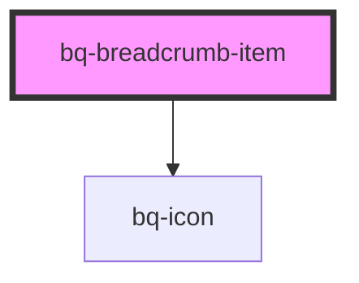

# bq-bread

<!-- Auto Generated Below -->

## Properties

| Property   | Attribute  | Description                                                                                | Type      | Default     |
| ---------- | ---------- | ------------------------------------------------------------------------------------------ | --------- | ----------- |
| `active`   | `active`   | Active the condition active of item, basically used by latest item in breadcrumb component | `boolean` | `undefined` |
| `dropdown` | `dropdown` | Contains an arrow If prop is set to true, it displays the options                          | `boolean` | `undefined` |
| `icon`     | `icon`     | Icon image used by the item in breadcrumb component                                        | `string`  | `undefined` |
| `link`     | `link`     | Contains a URL If prop is set, an anchor tag will be rendered                              | `string`  | `undefined` |

## Dependencies

### Depends on

- [bq-icon](../icon)

### Graph

----------------------------------------------

*Built with [StencilJS](https://stenciljs.com/)*
